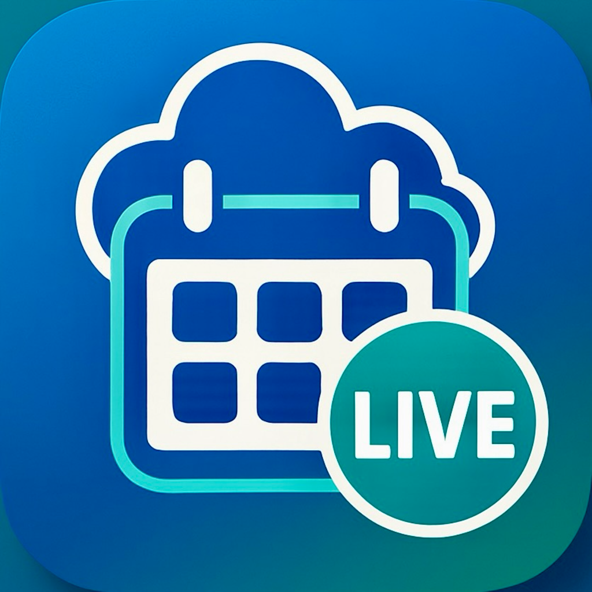

<div align="center">
  
  
  # LiveSchedule - Visual Calendar for the Future of Work

  > **Live Better with LiveSchedule**

  [](https://developer.apple.com/ios/)
  [](https://swift.org/)
  [](https://graphql.org/)
  []()
</div>

## ✨ What is LiveSchedule?


LiveSchedule transforms complex work schedules into **beautiful, intuitive timeline views** for the evolving workplace. As AI agents reshape how humans work, LiveSchedule provides the visual clarity and real-time coordination essential for **contact centres**, **healthcare teams**, and **organizations** navigating the future of human-AI collaboration.

## 🎯 Key Features

### 📊 **Visual Timeline Experience**
- **Smart Auto-Scroll**: Automatically shows timeline 1 hour before current time
- **Activity Icons**: Instant recognition with SF Symbols (Work 💼, Break ☕, Lunch 🍽️, Meeting 👥)
- **Live Status Indicators**: Real-time "LIVE" badges for current activities
- **Canvas-Based Rendering**: Smooth, responsive timeline with precise positioning

### ⚡ **Enterprise Features**
- **AWS GraphQL Integration**: Real-time data synchronization
- **Biometric Authentication**: Face ID/Touch ID with AWS Cognito security
- **Auto-Refresh**: Configurable updates (1-60 minutes)
- **Time Off Management**: Smart conflict resolution for overlapping activities

## 🏗️ Technical Architecture

### **GraphQL API Integration**
```graphql
query GetCalendarEventsByUserIdShiftDate($userId: String!, $shiftDate: $String!) {
  getCalendarEventsByUserIdShiftDate(userId: $userId, shiftDate: $shiftDate) {
    items {
      id, subject, start, end, activity_name, activity_type, activity_status
      user_id, username, routing_profile_name, paid, is_overtime
    }
  }
}
```

### **Modern iOS Stack**
- **SwiftUI + Canvas API**: High-performance timeline rendering
- **MVVM Architecture**: Clean separation with reactive data flow
- **AWS Services**: GraphQL APIs + Cognito authentication
- **Real-Time Updates**: Live data synchronization with intelligent caching

## 📱 Perfect For

### 📞 **Contact Centres & Customer Service**
Visual agent schedules with real-time status tracking and shift coverage monitoring.

### 🏥 **Healthcare & Shift Work**
Complex shift management with visual clarity for rotating schedules and compliance.

### 🏢 **Corporate Teams**
Meeting coordination with timeline-based resource allocation and status awareness.

## 💡 Why Choose LiveSchedule?

- **🌟 Visual-First**: Transform text-heavy schedules into intuitive timelines for the evolving workplace
- **⚡ Real-Time Intelligence**: Live indicators with intelligent auto-scroll for dynamic work environments
- **♿ Accessibility Excellence**: iOS Human Interface Guidelines compliance for inclusive future workplaces
- **🛡️ Enterprise Security**: AWS Cognito with biometric authentication for secure human-AI coordination
- **📱 Native Performance**: SwiftUI with 60fps timeline rendering optimized for modern workflows

## 📈 Business Benefits

**For Management**: Real-time team visibility, reduced scheduling conflicts, compliance verification

**For Employees**: Stress reduction, better work-life balance, mobile accessibility

**For IT**: Enterprise security, scalable GraphQL architecture, minimal maintenance

## 🚀 Getting Started

### **Enterprise Deployment**
1. **Contact Sales**: Discuss your scheduling needs
2. **AWS Configuration**: GraphQL API and Cognito setup
3. **Team Onboarding**: User credential distribution
4. **Go Live**: Immediate scheduling improvement

### **Technical Requirements**
- iOS 18.0+, iPhone/iPad compatible
- AWS Cognito user account
- Internet connection for real-time data

## 🎯 Roadmap

**Coming Soon**: Widget support, Live View, Apple Watch app, push notifications, offline support, real-time status integration, enhanced themes

**Future Vision**: Team collaboration, AI-powered scheduling, advanced analytics, integration hub

## 🤝 Contact

- **Enterprise Sales**: [enterprise@liveschedule.app](mailto:enterprise@liveschedule.app)
- **Technical Support**: [dev@liveschedule.app](mailto:dev@liveschedule.app)
- **Website**: [www.liveschedule.app](https://www.liveschedule.app)

---

**Ready to transform your team's scheduling experience?**

*LiveSchedule is production-ready and available for enterprise deployment.*

[](https://apps.apple.com/app/liveschedule)

*Enterprise deployment available now - App Store release coming soon*
